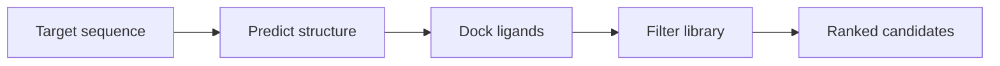

# Protein target → docking

> [!abstract] Goal
> From a protein target to a predicted structure and ranked small-molecule poses.

[Back to Recipes](index.md)  ·  [Skill Index](../index.md)

## Pipeline

## Steps

1. **[struct-predictor](../notes/drug-discovery-chem/struct-predictor.md)** — predict the 3D structure (Boltz-2). Sequence embeddings / design: **[esm](../notes/drug-discovery-chem/esm.md)**.
2. **[diffdock](../notes/drug-discovery-chem/diffdock.md)** — protein–ligand pose prediction / docking.
3. **[medchem](../notes/drug-discovery-chem/medchem.md)** — triage the library (drug-likeness rules, structural alerts).
4. **[rdkit](../notes/drug-discovery-chem/rdkit.md)** / **[datamol](../notes/drug-discovery-chem/datamol.md)** — parse, standardize, and featurize molecules.

## Triage & refine

- **[target-validation-scorer](../notes/drug-discovery-chem/target-validation-scorer.md)** + **[depmap](../notes/drug-discovery-chem/depmap.md)** — is the target worth pursuing?
- **[molecular-dynamics](../notes/drug-discovery-chem/molecular-dynamics.md)** — refine / validate binding with MD.
- Cloud batch chemistry: **[rowan](../notes/drug-discovery-chem/rowan.md)**.
